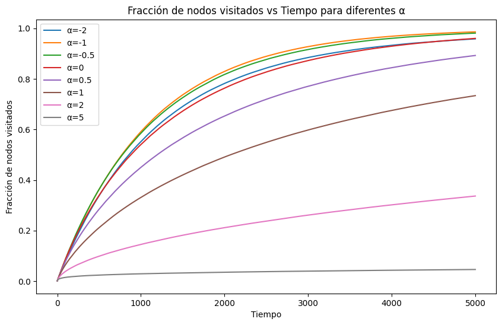
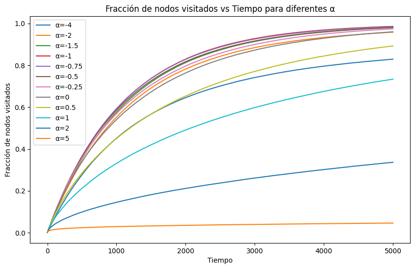
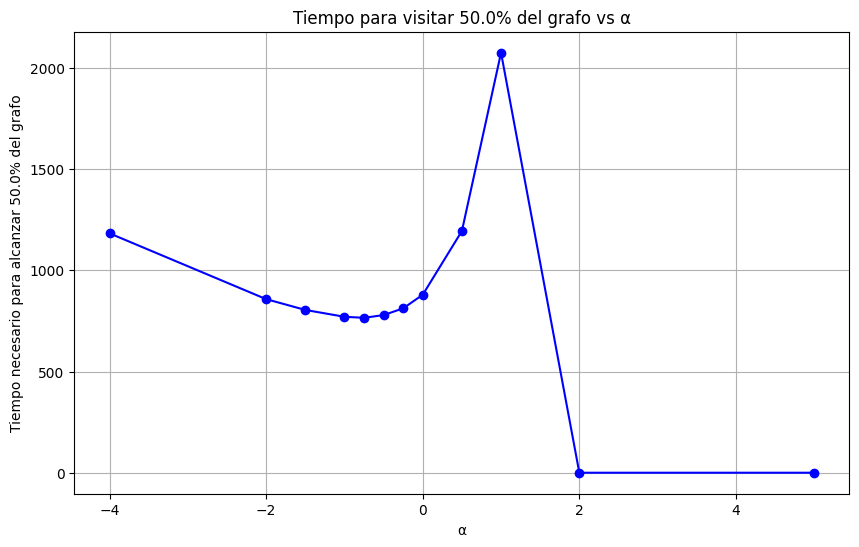

# Parte B: Análisis del Paseo por Popularidad en Grafos Barabasi-Albert

En esta segunda parte del examen, se analiza el comportamiento de un paseo por popularidad en un grafo generado bajo el modelo Barabasi-Albert. Este modelo es conocido por generar grafos con propiedades de escala libre, donde unos pocos nodos concentran la mayoría de las conexiones (alta popularidad), mientras que la mayoría de los nodos tienen un grado mucho menor. Esta estructura es común en redes sociales, biológicas y tecnológicas [1].

El objetivo inicial de este estudio es analizar la fracción del grafo visitada en función del tiempo para diversos valores del parámetro $\alpha$. Este parámetro modula la probabilidad de transición en el paseo, definida matemáticamente como:

$$
p(j|i) =
\begin{cases}
\displaystyle\frac{d_j^\alpha}{\sum\limits_{k:(i,k)\in E} d_k^\alpha} & \text{si} \ (i,j) \in E \\\\
0 & \text{si} \ (i,j) \notin E
\end{cases}
$$

donde $d_i$ es el grado del nodo $i$, $n$ es el número total de nodos, y $\alpha$ determina el peso relativo de los nodos más populares frente a los menos conectados. Valores altos de $\alpha$ favorecen transiciones hacia nodos de mayor grado, es decir, más populares, mientras que valores bajos permiten explorar nodos menos conectados.

## Procedimiento

1. **Estudio inicial de fracción visitada en función del tiempo**:
   Para comenzar, se simularon paseos en un grafo de tipo Barabasi-Albert con los siguientes parámetros iniciales: $n = 1000$ nodos, $m = 10$ enlaces por nodo añadido, y un límite temporal de $t_{\text{max}} = 5000$. Los valores de $\alpha$ considerados inicialmente fueron $\{-2, -1, -0.5, 0, 0.5, 1, 2, 5\}$. Se realizaron $n_{\text{tests}} = 1000$ pruebas para cada valor de $\alpha$, calculando la fracción promedio de nodos visitados en función del tiempo. Esto, nos permitió identificar las tendencias generales en el comportamiento del paseo para diferentes configuraciones.

2. **Ampliación del rango de valores de $\alpha$**:
   Basándose en los resultados iniciales, se amplió el rango de estudio para incluir valores intermedios ($\alpha = -0.25$, $-0.75$, $-1.5$) y extremos ($\alpha = -4$). Esto permitió refinar el análisis y explorar cómo valores menos comunes impactan la eficiencia del paseo.

3. **Cálculo del tiempo promedio necesario para alcanzar el 50% del grafo**:
   Como medida complementaria, se evaluó el tiempo promedio necesario para visitar el 50% del grafo. Esta métrica proporciona una perspectiva adicional sobre la eficiencia del paseo, más allá del análisis temporal de la fracción visitada.

## Resultados

### Fracción Visitada en Función del Tiempo

#### Valores Iniciales de $\alpha$

- Para valores altos de $\alpha$ ($\alpha > 1$), el paseo se concentra en unos pocos nodos de alto grado, los denominados "populares", lo que resulta en una exploración limitada del grafo y una fracción visitada baja.
- Valores bajos de $\alpha$ ($\alpha < -1$) también presentan un comportamiento subóptimo, ya que la probabilidad asignada a cada nodo tiende a ser uniforme y baja, ralentizando la exploración.
- Los mejores resultados se observaron para valores intermedios como $\alpha = -0.5$ y $\alpha = -1$, que lograron un equilibrio entre explorar los nodos más populares y los menos conectados, consiguiendo una fracción visitada más alta en menos tiempo.

#### Valores Adicionales de $\alpha$

- Al ampliar el rango de $\alpha$ hacia valores extremos ($\alpha = -4$), se observó que el rendimiento disminuye considerablemente debido a que la probabilidad de transición se concentra en nodos de bajo grado, perjudicando la eficiencia.
- Valores intermedios como $\alpha = -0.75$ y $\alpha = -0.25$ destacaron por su rendimiento, maximizando la exploración en menor tiempo. En particular, $\alpha = -0.75$ sobresalió como el mejor valor.

### Tiempo Promedio para Alcanzar el 50% del Grafo

Para complementar el análisis anterior, se calculó el tiempo promedio necesario para visitar el 50% del grafo para cada valor de $\alpha$, esto nos permite evaluar los valores de $\alpha$ que logran un mejor equilibrio.

- Podemos observar que es una función convexa, con un mínimo entre $\alpha = -1$ y $\alpha = -0.5$.
- Esto nos indica que los valores menores a $\alpha = -1$ y mayores a $\alpha = 0$ son menos eficientes para visitar el 50% del grafo.
- A partir de $\alpha = 1$, no se llega a visitar el 50% del grafo en el tiempo máximo de simulación ($t_{\text{max}} = 5000$).
- El valor óptimo para visitar el 50% del grafo es $\alpha = -0.75$, aun así, otros valores cercanos como $\alpha = -0.5$ y $\alpha = -1$ también presentan buenos resultados.

## Conclusión

El parámetro $\alpha$ desempeña un papel crucial en la dinámica del paseo por popularidad. Este estudio demuestra que valores cercanos a $\alpha = -0.75$ son ideales para maximizar la eficiencia en grafos de tipo Barabasi-Albert, logrando un equilibrio entre explorar nodos populares y menos conectados.

Estos resultados podrían ser útiles por ejemplo, en la publicidad en redes sociales, donde se busca maximizar la exposición de un producto o servicio a través de la exploración de diferentes segmentos de la audiencia, o en la optimización de motores de búsqueda entre otros.

Además, el análisis sugiere que valores extremos, tanto altos como bajos, tienden a ser ineficientes debido a la falta de balance entre exploración y explotación.

## Referencias

[1]: https://en.wikipedia.org/wiki/Barab%C3%A1si%E2%80%93Albert_model

1: [Wikipedia. Barabási–Albert model.](https://en.wikipedia.org/wiki/Barab%C3%A1si%E2%80%93Albert_model)
